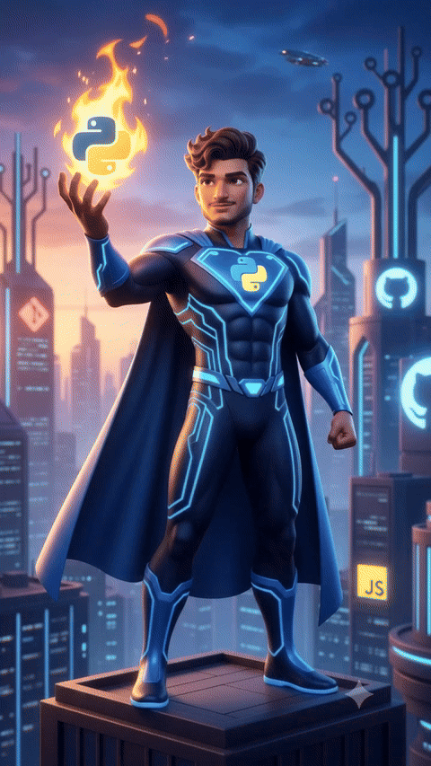

<!-- Header Banner -->

  

<!-- Tagline -->
<h2 align="center">🚀 AI/ML Engineer & Builder</h2>

  <strong>Building intelligent systems and full-stack applications with real-world impact.</strong>

<!-- Social Links -->

  
  
  

<!-- Animated Media / Demo -->

  

<!-- About Me Section -->
<table>
  <tr>
    <td width="55%" valign="top">
      <h3>👨‍💻 About Me</h3>
      

        I am a B.Tech AI/ML student at Jain University specializing in building intelligent systems and full-stack applications. I focus on bridging the gap between machine learning models and production-ready applications.
      

      <ul>
        <li>🔭 <strong>Currently working on:</strong> FarmersRent (Equipment Rental Platform) and AI/ML-based applications</li>
        <li>🌱 <strong>Currently learning:</strong> Data Structures & Algorithms, Full-Stack Development, Deep Learning, and System Design</li>
        <li>👯 <strong>Looking to collaborate on:</strong> Open Source Projects, Machine Learning Applications, and Full-Stack Web Development</li>
        <li>🤔 <strong>Looking for help with:</strong> Advanced Backend Development, Cloud Deployment, and Scalable AI Systems</li>
        <li>💬 <strong>Ask me about:</strong> Java, Python, Machine Learning, Computer Vision, Node.js, PostgreSQL, and Web Development</li>
        <li>📫 <strong>How to reach me:</strong> <a href="mailto:aravindreddy8189@gmail.com">aravindreddy8189@gmail.com</a></li>
        <li>😄 <strong>Pronouns:</strong> He/Him</li>
        <li>⚡ <strong>Fun fact:</strong> Built a multi-face recognition attendance system with ~97% accuracy, enjoy solving real-world problems through AI and software development, and won an ideathon.</li>
      </ul>
    </td>
    <td width="45%" valign="top">
      <h3>🚀 Current Projects & Focus</h3>
      <ul>
        <li><strong>FarmersRent</strong>: A high-performance farm equipment rental platform built with Next.js, Express, Supabase, Redis, and Socket.IO.</li>
        <li><strong>ASL Communication</strong>: Two-way ASL sign language platform using MediaPipe landmark-based MLP classifier and Three.js hand animations.</li>
        <li><strong>Sentinel AI</strong>: Industrial monitoring dashboard integrating GPT-4o, Gemini, Grok, and Claude APIs.</li>
      </ul>
    </td>
  </tr>
</table>

<!-- Skills Showcase -->
<h3>🛠️ Tech Stack & Skills</h3>

<table>
  <tr>
    <td align="center" width="16%"><strong>Backend</strong></td>
    <td>
      
    </td>
  </tr>
  <tr>
    <td align="center" width="16%"><strong>Frontend</strong></td>
    <td>
      
    </td>
  </tr>
  <tr>
    <td align="center" width="16%"><strong>Databases</strong></td>
    <td>
      
    </td>
  </tr>
  <tr>
    <td align="center" width="16%"><strong>DevOps & Cloud</strong></td>
    <td>
      
    </td>
  </tr>
  <tr>
    <td align="center" width="16%"><strong>AI & Concepts</strong></td>
    <td>
      
      
      
      
    </td>
  </tr>
  <tr>
    <td align="center" width="16%"><strong>Tools</strong></td>
    <td>
      
    </td>
  </tr>
</table>

<!-- GitHub Analytics Section -->
<h3>📊 GitHub Analytics</h3>

  

  
  

  

<!-- Footer Banner -->

  

